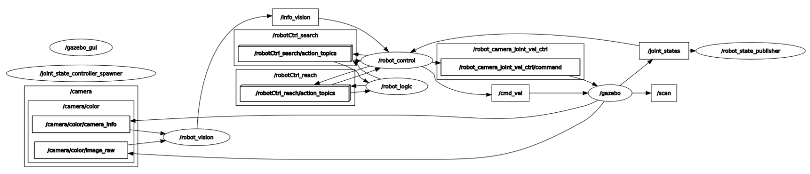
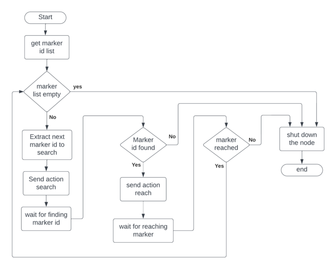
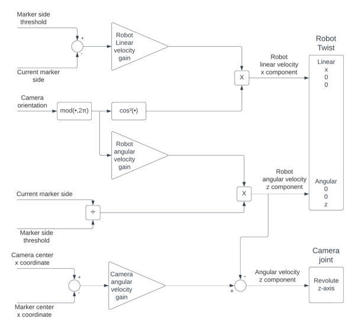

In this document the following arguments will be presented:
- [Introduction](#introduction)
- [Installation](#installation)
- [Use](#use)
- [Architecture](#architecture)
    - [logic.py](#logicpy-source)
    - [control_action_server.py](#control_act_serverpy-source)
    - [robot_vision.py](#robot_visionpy-source)
- [Improvements](#improvements)

# Introduction
In this repository, the [ROS](https://www.ros.org) package `assignment_1` has been implemented to satisfy the requirements of the first assignment of the course [Experimental Robotics Laboratory](https://corsi.unige.it/en/off.f/2023/ins/66551?codcla=10635) of [Robotics Engineering](https://corsi.unige.it/en/corsi/10635) course by [University degli Studi di Genova](https://unige.it).  
The assignment depends on the [aruco](https://github.com/pal-robotics/aruco_ros/tree/noetic-devel/aruco) package for acquiring and parsing the image from the camera. The robot is a [Husarion ROSbot 2R](https://husarion.com/#robots) and its model is provided by the package [rosbot_description](https://github.com/husarion/rosbot_ros/tree/noetic/src/rosbot_description). Both packages, `aruco` and `rosbot_description`, are included in this repository for convenience.  
The requirements for the assignment is to look for markers in the environment and reach them. For further details on the requirements, see [main](https://github.com/davideCaligola/experimentalRoboticsLab_assignment1/tree/main#Introduction) branch.

> Due to working conditions, the pixel threshold for the marker size within the frame camera has been reduced to 175 pixels with respect to the 200 pixed defined in the assignment requirements.

In the following sections, more insights on how to install and use the provided packages and more details on the used architecture are presented.

# Installation
Requirements:
- ROS Noetic environment is already installed and working properly,
- Git version control system properly installed,
- a proper Github SSH key setup (see [Adding a new SSH key to your GitHub account](https://docs.github.com/en/authentication/connecting-to-github-with-ssh/adding-a-new-ssh-key-to-your-github-account) for more information about it)  

The software has been tested in a machine with Linux Ubuntu 20.04 LTS.  
The package `assignment_1` makes use of the terminal [xterm](https://invisible-island.net/xterm/) to provide information via a separated console.  
In Ubuntu, it is possible to install it using the apt command:  
```shell
sudo apt update && sudo apt -y install xterm
```
To use the packages in this repository, create a directory where a catkin workspace will be created for running the packages:
```
mkdir test_ws
```
Clone the repository in the test_ws/src folder:
```
git clone -b action_server --single-branch git@github.com:davideCaligola/experimentalRoboticsLab_assignment1.git test_ws/src
```
Navigate into the workspace folder and build the packages
```
cd test_ws
catkin_make
```
Setup the current workspace
```
source ./devel/setup.bash
```
Copy the marker models in the local directory `.gazebo`, otherwise the marker will not be visible in the Gazebo environment.
```
mkdir -p ~/.gazebo
cp -r ./src/assignment_1/aruco_models/* ~/.gazebo
```
Launch the simulation
```
roslaunch assignment_1 assignment_1.launch
```
See section [Use](#use) for the available launch options.  

# Use
The simulation can be started with the provided launch file:
```
roslaunch assignment_1 assignment_1.launch
```
The Gazebo and RViz environments open showing the rosbot within the provided world with the markers.  
The rosbot will turn to look for the searched marker and once found it, it moves close to it. It repeats the process for all the markers in the world.  
Once the rosbot reaches the last marker, the process terminates and closes all the started processes.  
The cycle rate of the logic and its controller can be set with the parameter `rate` in the `assignment_1.launch` file or from command line:
```
roslaunch assignment_1 assignment_1.launch rate:=20
```
The rate the vision node publishes the information collected from the camera can be set with the parameter `rate_vis` in the `assignment_1.launch` file or from command line:
```
roslaunch assignment_1 assignment_1.launch rate_vis:=20
```  
An example of simulation run is shown in the following video.

https://github.com/davideCaligola/experimentalRoboticsLab_assignment1/assets/114524396/3a8f000c-2b90-4a1f-9511-701df0006fef


# Architecture
To manage the rosbot in a flexible way, an architecture based on an action server has been developed and three nodes have been developed:
- [logic.py](#logicpy-source)
- [contro_act_server.py](#control_act_serverpy-source)
- [robot_vision.py](#robot_visionpy-source)  

The developed nodes, the Gazebo and RViz environment are organized as shown in the following `rqt_graph`:  
  
*`rqt_graph` of the rosbot simulation with camera revolute joint*

The following sections describes in more details each developed node.

## logic.py ([source](./assignment_1/script/logic.py))
It coordinates the action the rosbot needs to achieve sending goals to the action server implemented in the controller:  
 - defines the list of marker ids to look for  
 - sends to the action server `/robotCtrl_search` the goal with the marker id to look for  
 - sends to the action server `/robotCtrl_reach` the goal with the marker id to reach and the threshold size of the marker side seen in the camera frame.  
 - quits the simulation.  

It implements a simple state machine to control the actions of the rosbot, as represented in the following state machine:  
  
*`logic.py` node state machine*

## control_act_server.py ([source](./assignment_1/script/control_act_server.py))  
It subscribes to the topic `/info_vision` to receive information about  
- marker id
- marker 4 corners position within the camera frame
- marker and camera center position within the camera frame  

It implements two action servers:  
- `/robotCtrl_search` (see [RobotCtrl_search.action](./assignment_1/action/RobotCtrl_search.action) definition)
    - it receives as goal the marker id to look for
    - it provides as feedback the current seen id
    - it returns as result `True`, if the marker is found; `False` if the goal is preempted

To look for the target marker id, the node sends on the topic `/cmd_vel` an angular velocity command along the z-axis to rotates the robot on itself.  

- `/robotCtrl_reach` (see [RobotCtrl_reach.action](./assignment_1/action/RobotCtrl_search.action) definition)
    - it receives as goal the marker id to reach and the size threshold the marker must have within the camera size  
    - it provides as feedback, the current marker id and marker size seen by teh camera  
    - it returns as result `True`, if the marker size in the camera frame reaches the goal marker size threshold; `False` if the goal is preempted.  

To reach the target marker, the controller publishes two control velocities as twist on the topic `/cmd_vel` to control the rosbot:
- linear velocity along x-axis to get close to the target marker.  
The amplitude is proportional to the difference between the marker side threshold and the size of the marker side in the current camera frame. However, it is modulated by the amplitude of the angular mismatch between the rosbot body and the camera orientations. This way, it is possible to give more priority to the alignment of the rosbot with the camera orientation  
- angular velocity along z-axis to align the rosbot body with the camera orientation.  
It is scaled by the ratio between the current marker side size and the marker side threshold. This way it is possible to have a sort of estimation of the distance to the marker: if the marker is far, the ratio is small and the correction on the angular velocity is reduced, vice-versa if the marker is close.

To keep the marker in the middle of the camera view, a control is applied to the revolute joint of the camera and published on the topic `/robot_camera_joint_vel_ctrl/command`.  
The command is proportional to the distance between the two centers and it is compensated by the angular velocity of the rosbot body.

The implemented control law is represented in the following schema:  
  
*`control_act_server.py` control schema*

The reach control is considered successful when the size of marker side seen in the camera is not less than the specified threshold.  

## robot_vision.py ([source](./assignment_1/script/robot_vision.py))  
It subscribes to the following camera topics:
- `/camera/color/camera_info`  
    to calculate the position of the camera center  
- `/camera/color/image_raw`  
    to extract information about the marker in view  

It publishes the topic `/info_vision`, which provides data about the current seen marker id and the four corners of the marker.  

```
int32[] ids
float32[] camera_center
float32[] marker_center
float32[] marker_top_right
float32[] marker_top_left
float32[] marker_bottom_left
float32[] marker_bottom_right
```
*`/info_vision` topic*

# Improvements
The package can be improve considering the following points:
- there is not any error handling,
- the vision system handles only one marker per time. If more than a marker is in the camera view, only the first one in the list provided by the camera is considered,
- if the camera does not find the searched marker id, the camera keeps on turning looking for the marker id indefinitely. It could be implemented a timeout or some other exception handle.
- there is not any obstacle avoidance. If, by any chance, the control is not able to reach the threshold for the marker size in the camera frame, it will crash against the marker,
- if, while reaching the target marker id, the marker is no longer within the vision of the camera, the behaviour of the robot could be unexpected,
- the control is basically a simple proportional controller tuned heuristically. A better controller could be designed,  
- currently, once the rosbot reaches the last marker, the `logic.py` node terminates. Since it is a required node, its termination triggers all other processes to terminate as well. A more graceful shut down procedure could be devised.
